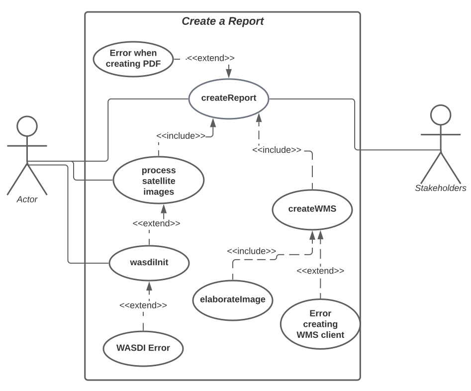

# Genarate a full report on WASDI

## Design Requirement Specification Document

DIBRIS – Università di Genova. Scuola Politecnica, Corso di Ingegneria del Software 80154

 <b> Authors </b>   Abdullah Al Foysal  Alessandro Drago 

### REVISION HISTORY

Version | Data | Author(s)| Notes
---------|------|--------|------
1 | 05/21/23 | Alessandro Drago | First Versionn of the document. Document Template

## Table of Content

1. [Introduction](#intro)
    1. [Purpose and Scope](#purpose)  
    2. [Definitions](#def)
    3. [Document Overview](#overview)
    4. [Bibliography](#biblio)
2. [Project Description](#description)
    1. [Project Introduction](#project-intro)
    2. [Technologies used](#tech)
    3. [Assumptions and Constraints](#constraints)
3. [System Overview](#system-overview)
    1. [System Architecture](#architecture)
    2. [System Interfaces](#interfaces)
    3. [System Data](#data)
        1. [System Inputs](#inputs)
        2. [System Outputs](#outputs)
4. [System Module 1](#sys-module-1)
    1. [Structural Diagrams](#sd)
        1. [Class Diagram](#cd)
            1. [Class Description](#cd-description)
        2. [Object Diagram](#od)
        3. [Dynamic Models](#dm)
5. [System Module 2](#sys-module-2)
   1. ...

##    1 Introduction

    
 The design specification document reflects the design and provides directions to the builders and coders of the product.
 
    Through this document, designers communicate the design for the product to which the builders or coders must comply. The design specification should state how the design will meet the requirements.

    
###  1.1 Purpose and Scope

 
    
 The goal of this section is to describe the purpose of this document and intended audience  

    
This sub section should describe ...

###  1.2 Definitions

 
    
 Put a summary of the section
    

    
This sub section should describe ...

    
| First Header  | Second Header |
| ------------- | ------------- |
| Content Cell  | Content Cell  |
| Content Cell  | Content Cell  |
    

###  1.3 Document Overview

 
    
 Explain how is organized the document
    

    
This sub section should describe ...

###  1.4 Bibliography

 
    
 Put a summary of the section
    

    
This sub section should describe ...

##  2 Project Description

###  2.1 Project Introduction 

 
    
Through workspaces and applications in the marketplace, researchers are able to collect satellite data and run algorithms on them. Once this phase is finished, a required feature is the ability to create a report in PDF containing all the information from the processing.This report will then be given by the researchers to those less experienced users or stakeholders. 
    The document shall have a predefined template in which various information such as date, name and logo of the company, images that were processed and explanatory paragraphs of text are present.
    The images found in WASDI's workspace are in TIFF format and therefore before they are inserted into the document, they must be processed. 
    On the various servers in which these images are stored is an instance of GeoServer is present. 
    So the idea is to take the images from the WASDI workspace, process them with GeoServer by, for example, selecting a certain area of that image, or applying a style, and return this image in a desirable format (PNG or GIF).

###  2.2 Technologies used

 
    
 Software used to develope the algorithm. 

    
https://www.jetbrains.com/pycharm/  (PyCharm IDE)

    
https://www.wasdi.net/#!/home (WASDI cloud services and libraries)

    
https://geoserver.org/ (GeoServer Open source server for sharing geospatial data)

###  2.3 Assumption and Constraint 

 
    
 Assumptions and Constraints

    
Since this is a WASDI processor you will need an account to execute the code correctly.

##   3 System Overview

 
    
 Put a summary of the section
    

    

###   3.1 System Architecture

 
    
 Put a summary of the section
    

    
...

###   3.2 System Interfaces

 
    
 Put a summary of the section
    

    
This sub section should describe ...

###   3.3 System Data

 
    
 Put a summary of the section
    

    
This sub section should describe ...

####   3.3.1 System Inputs

 
    
 Put a summary of the section
    

    
This sub section should describe ...

####   3.3.2 System Ouputs

 
    
 Put a summary of the section
    

    
This sub section should describe ...

##   4 System Module 1

 
    
 Put a summary of the section
    

    
This sub section should describe ...

###   4.1 Structural Diagrams

 
    
 Put a summary of the section
    

    
This sub section should describe ...

####   4.1.1 Class diagram

 
    
 Put a summary of the section
    

    
This sub section should describe ...

#####   4.1.1.1 Class Description

 
    
 Put a summary of the section
    

    
This sub section should describe ...

####   4.1.2 Object diagram

 
    
 Put a summary of the section
    

    
This sub section should describe ...

####   4.2 Dynamic Models

 
    
 Put a summary of the section
    

    
This sub section should describe ...

