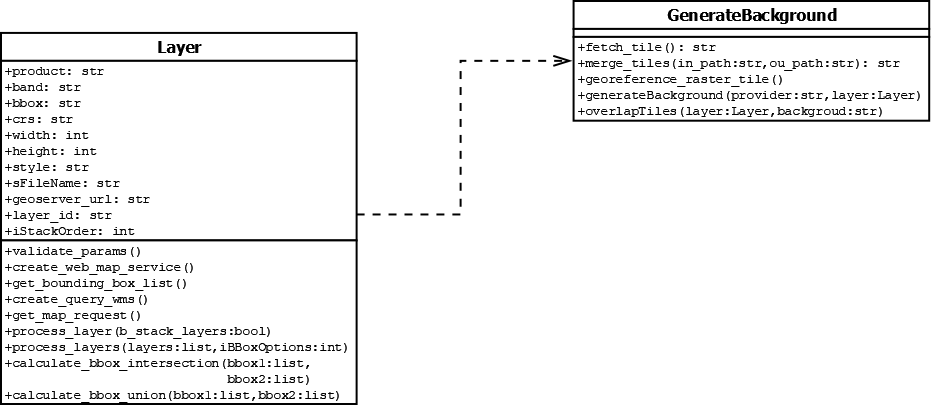

# Genarate a full report on WASDI

## Design Requirement Specification Document

DIBRIS – Università di Genova. Scuola Politecnica, Corso di Ingegneria del Software 80154

 <b> Authors </b>   Abdullah Al Foysal  Alessandro Drago 

### REVISION HISTORY

Version | Data | Author(s)| Notes
---------|------|--------|------
1 | 05/21/23 | Alessandro Drago | First Versionn of the document. Document Template.
2 | 05/22/23 | Alessandro Drago | Added System Architecture and refined some parts.
3 | 06/08/23 | Alessandro Drago | Refined some parts.
4 | 07/08/23 | Abdullah Al Foysal, Alessandro Drago | Added some parts.
5 | 10/30/23 | Alessandro Drago | Fixes.

## Table of Content

1. [Introduction](#intro)
    1. [Purpose and Scope](#purpose)  
    2. [Definitions](#def)
    3. [Document Overview](#overview)
    4. [Bibliography](#biblio)
2. [Project Description](#description)
    1. [Project Introduction](#project-intro)
    2. [Technologies used](#tech)
    3. [Assumptions and Constraints](#constraints)
3. [System Overview](#system-overview)
    1. [System Architecture](#architecture)
    2. [System Interfaces](#interfaces)
    3. [System Data](#data)
        1. [System Inputs](#inputs)
        2. [System Outputs](#outputs)
4. [System Module 1](#sys-module-1)
    1. [Structural Diagrams](#sd)
        1. [Class Diagram](#cd)
            1. [Class Description](#cd-description)
        2. [Object Diagram](#od)
        3. [Dynamic Models](#dm)
5. [System Module 2](#sys-module-2)
   1. ...

##    1 Introduction

    
 The design specification document reflects the design and provides directions to the builders and coders of the product.
 
    Through this document, designers communicate the design for the product to which the builders or coders must comply. The design specification should state how the design will meet the requirements.

    
###  1.1 Purpose and Scope

 
    
 The goal of this is to create a full report of the analysis done by the reaserchers on WASDI.
    

    
The project involves the developement of a platform that helps Earth Observation (EO) experts process satellite imagery on the cloud. The team at WASDI is working on developing new software tools that can extract images and data from the results of the analytics tools present on the platform, in order to help communicate the results of the analyses to the stakeholders involved. The project aims to ease the communication of the results of the applications so that decision makers can better understand the phenomena they are dealing with.

    
Moreover, we would like to take the different layers in a workspace and overlay them in various ways by selecting the final bounding box from different options such as union, intersection or the bbox of a specific layer. After that we would like to generate this image in different formats such as PNG, JPG or GIF. The generated images should then be inserted into the report.

###  1.2 Definitions
    
| Acronym				| Definition | 
| ------------------------------------- | ----------- | 
| SE23                                 | Software Engineering course, 2023 at university of Genoa |
| SE-80154							   | Software Engineering course, 2023 at university of Genoa, 80154 is its ID number |
| FadeOut Software					   | Company holder of WASDI |
| WASDI								   | Web Advanced Space Developer Interface |
| Workspace							   | Space on WASDI where a user can store and manipulate satellitar images |
| EO					   			   | Earth Observation |
| GeoServer					   		   | Open source server for sharing geospatial data |
| TIFF					   			   | Stands for Tag Image File Format. It is a file format used to store raster graphics and image information. |
| GIF					   			   | Stands for Graphics Interchange Format. It's an image file format that can be used to create still images or animated images |
| Band					   			   | Range of frequencies along the electromagnetic spectrum that the satellite measures |
| Bounding-Box						   | Imaginary rectangle that outlines an object in an image |
| CRS					   			   | Stands for Coordinate Reference System. Defines how georeferenced spatial data relates to real locations on the Earth’s surface |
| EPSG					   			   | Stands for European Petroleum Survey Group. It's a unique identifier for a coordinate system or a projection. |
| SLD					   			   | Stands for Styled Layer Descriptor. It's an XML file used for styling TIFF images  |

###  1.4 Bibliography

 
    
 Useful documentation 
    

    
https://wasdi.readthedocs.io/en/latest/index.html (WASDI documentation)

    
https://docs.geoserver.org/ (GeoServer documentation)

    
https://gdal.org/index.html (GDAL documentation)

    
https://wrobell.dcmod.org/geotiler/usage.html (GeoTiler documentation)

##  2 Project Description

###  2.1 Project Introduction 

 
    
Through workspaces and applications in the marketplace, researchers are able to collect satellite data and run algorithms on them. Once this phase is finished, a required feature is the ability to create a report in PDF containing all the information from the processing.This report will then be given by the researchers to those less experienced users or stakeholders. 
    The document shall have a predefined template in which various information such as date, name and logo of the company, images that were processed and explanatory paragraphs of text are present.
    The images found in WASDI's workspace are in TIFF format and therefore before they are inserted into the document, they must be processed. 
    On the various servers in which these images are stored is an instance of GeoServer is present. 
    So the idea is to take the images from the WASDI workspace, process them with GeoServer by, for example, selecting a certain area of that image, or applying a style, and return this image in a desirable format (PNG or GIF).

###  2.2 Technologies used

 
    
 Software used to develope the algorithm. 

    
https://www.jetbrains.com/pycharm/  (PyCharm IDE)

    
https://www.wasdi.net/#!/home (WASDI cloud services and libraries)

    
https://geoserver.org/ (GeoServer Open source server for sharing geospatial data)

###  2.3 Assumption and Constraint 

 
    
 Assumptions and Constraints

    
Since this is a WASDI processor you will need an account to execute the code correctly.

##   3 System Overview

 
    
 System Overview
    

    
Graphical representation of the system overview.

    

| Use Case      | 1.0           |
| ------------- | ------------- |
| Name          | ImgProcessing |
| Actors        | Expert User  |    
| Entry Point   | (i) List of Input Arguments   (ii) List of Output Arguments   |
| Exit  Point   | File where the processed image must be stored in the correct format |
| Event Flow    | (1) User invoke the system by command line (for now)   (2) User provide a valid path to an input image in .TIFF format present in a WASDI workspace   (3) User provide a list of symbols representing the input arguments   (4) User provide a list of arguments representing the output arguments   (5) User provide a valid file name where the system should store the output image   (6) System validates the input image   (7) System validates the list of input arguments   (8) System valdiates the list of output arguments   (9) System validates the output file   (10) Input image is uploaded on an instance of GeoServer   (11) The new layer is processed following the input arguments   (12) System correctly process the input file and store the image in memory   (13) System write the image in memory into the output file |
    
    
| Use Case      | 2.0           |
| ------------- | ------------- |
| Name          | Report Creation |
| Actors        | Expert User |    
| Entry Point   | List of Input Arguments |
| Exit  Point   | PDF file where the analysis report must be stored |
| Event Flow    | (1) User invoke the system by command line (for now)   (2) User provide a list of sysmbols representing the input arguments   (3) User provide a valid file name where the system should store the PDF document   (4) System validates the input arguments   (5) System validates the output file   (6) System write the text into the output file | 

###   3.1 System Architecture

 
    
 Graphic of the System Architecture
    

    
Graphical representation of the system architecture.

    

###   3.2 System Interfaces

 
    
 The system should use a command line interface.
    

    
For now we'll develop a command line interface using Python, but a graphical interface will be added in the future.

###   3.3 System Data

 In this section we describe the inputs and their format.

####   3.3.1 System Inputs

 
    
 Here we describe the line inputs of the system.
    

    
The system takes in input two JSON files: the parameters file and a config file required to work with WASDI. In the config file there is the username and password to access WASDI, the workspace name, and the path to the parameters file.
 
    
 In the parameters JSON file the inputs of the system are: 

    <ul> 
        <li> PRODUCT: name of an image in .TIFF format present in the WASDI workspace that we want to process.</li>
        <li> BAND: Range of frequencies along the electromagnetic spectrum that the satellite measures.</li>
        <li> BBOX: A json structure divided into "northEast" and "southWest", in each subfield is specified both a latitude and a longitude. This defines the desired area.</li>
        <li> CRS: Stands for Coordinate Reference System. Defines how georeferenced spatial data relates to real locations on the Earth’s surface.</li>
        <li> WIDTH: desidered width of the image.</li>
        <li> HEIGHT: desidered height of the image.</li>
        <li> FORMAT: desidered format of the image. See at (https://docs.geoserver.org/stable/en/user/services/wms/outputformats.html).</li>
        <li> STYLE: XML file used for styling TIFF images.</li>
        <li> LAYER ID: id of a layer already present on a GeoServer instance.</li>
        <li> GEOSERVER URL: link to an existing server.</li>
    </ul>

####   3.3.2 System Ouputs

 
    
 Here we describe the line outputs of the system.
    

    
The final output of the system is a report in PDF containing all the information from the processing done in WASDI. This report will then be given by the researchers to those less experienced users or stakeholders.

##   4 System Module 1

 
    
 Put a summary of the section
    

    
The system module in the given code plays a crucial role in generating the PDF report. It encompasses various components and functions that contribute to the overall functionality and structure of the system. At the core of the system module is the CustomPDF class, which extends the FPDF class. This class serves as the foundation for creating a customized PDF report. It handles the header, index, chapter titles, content, and footer sections of the report.
The header method within the CustomPDF class takes care of setting up the header section of the report. It includes the report title, logo, author's name, company name, and address. These details provide essential context and identification for the report.
The generate_index method is responsible for generating the index section of the report. It iterates over the provided chapters and extracts their titles, creating an organized and structured index for easy navigation.
To maintain consistency and enhance readability, the footer method is implemented. It adds a footer to each page, displaying the current page number. This feature allows readers to track their progress and locate specific information within the report.
The chapter_title method plays a crucial role in visually distinguishing the different chapters. It formats and highlights the chapter titles by applying a red background color and white text, making them stand out in the report.
The chapter_body method handles the content within each chapter. It prints the subtitles and content, allowing for detailed descriptions and explanations. Additionally, it provides support for including optional images that further enhance the presentation and understanding of the content.
The print_chapter method combines the chapter title and body, enabling the printing of complete chapters with their respective sections. This ensures that the report maintains a logical and organized structure.
The create_pdf function acts as the main component for generating the PDF report. It initializes the CustomPDF object, sets the author, adds pages, and iterates over the chapters to print them in the correct order.
To ensure that the provided parameters are valid, the validate_parameters function checks for missing or incorrect values. It assigns default values to any missing fields and raises warnings for any potential issues.
The sanitize_parameters function removes leading or trailing whitespace from the parameters. This helps maintain consistency and avoid any formatting or display discrepancies within the report.
Overall, the system module forms the backbone of the PDF report generation process. It combines different components and functions to produce a well-structured and visually appealing report based on the provided parameters.

###   4.1 Structural Diagrams

 
    
 Put a summary of the section
    

    
The given code implements a Python script for generating a PDF report using the FPDF library. The script follows a modular structure and begins by importing the necessary modules, including JSON, wasdi, os, FPDF, and PIL.Image.
The core functionality is encapsulated within the CustomPDF class, which inherits from the FPDF class and provides additional customization options. The class has an __init__ method that initializes the CustomPDF object with the provided parameters and sets the initial state of the index_added attribute.
The header method handles the generation of the header section in the PDF. It extracts the required header parameters from the provided dictionary and sets the logo, title, author name, company name, and address accordingly.
The generate_index method is responsible for creating the index text by iterating over the chapters and their titles. It generates a formatted index with the chapter numbers and titles.
The footer method adds the footer section to each page, displaying the current page number.
The chapter_title method is used to print the title of each chapter. It applies a red background color and white text to highlight the chapter titles.
The chapter_body method is responsible for handling the content of each chapter. It prints the subtitles, content, and optional images for each section.
The print_chapter method combines the chapter title and body to print a complete chapter with its sections.
The create_pdf function is responsible for creating the PDF report. It initializes a CustomPDF object, sets the author, adds pages, and iterates over the provided chapters to print them.
The validate_parameters function ensures that the provided parameters contain the necessary fields. If any required fields are missing, it assigns default values to them.
The sanitize_parameters function removes any leading or trailing whitespace from the parameters to ensure consistent formatting.
The run function serves as the main entry point of the script. It reads the parameters from a JSON file, validates and sanitizes them, and then calls the create_pdf function to generate the PDF report.

In summary, the code utilizes object-oriented programming and modular design principles to create a PDF report generator. It allows for customization of the header, index, chapter titles, and content, including optional images. The script provides flexibility for generating informative and visually appealing PDF reports based on the provided parameters.

####   4.1.1 Class diagram

 
    
 Put a summary of the section
    

    
    

#####   4.1.1.1 Class Description

 
    
 This class diagram represents the structure and relationships of the CustomPDF class and its methods based on the provided code
    

    
The class <b>CustomPDF</b> represents a customized version of the FPDF class for PDF generation.

    
Attributes: 

    <ul> 
        <li> asParametersDict: a private attribute to hold the parameters dictionary.</li>
    </ul>
    
Methods: 

    <ul>
        <li> header(): generates the header section of the PDF.</li>
        <li> footer(): generates the footer section of the PDF.</li>
        <li> chapter_title(ch_num, ch_title): generates the chapter title section of the PDF.</li>
        <li> chapter_body(chapter_data): generates the chapter body section of the PDF.</li>
        <li> print_chapter(ch_num, ch_title, chapter_data): prints a chapter, combining the title and body sections.</li>
    </ul>
     
    
The class <b>Layer</b> is a custom representation of a Layer.

    
Attributes: 

    <ul> 
        <li> product : str Identifier for a product inside the WASDI workspace</li>
        <li> band : str Identifier for the band of the product</li>
        <li> bbox : str Bbox options used for selecting an area in the world</li>
        <li> crs : str Coordinate Reference System used</li>
        <li> width : int Width of the image</li>
        <li> height : int Height of the image</li>
        <li> style : str Name of a sld style file present on a WASDI workspace</li>
        <li> sFileName : str Name of the output image</li>
        <li> geoserver_url : str Link for a custom geoserver url</li>
        <li> layer_id : str Identifier of a layer in a Geoserver workspace</li>
        <li> iStackOrder : int Order on which we want to stack layers</li>
    </ul>
    
Methods: 

    <ul>
        <li> validate_params(): Validate arguments for a Layer.</li>
        <li> create_web_map_service(): Create a WebMapService object.</li>
        <li> get_bounding_box_list(): Calculate the best bbox if it is not present.</li>
        <li> set_size(): Set the sizes for the output image if the user didn't provide them.</li>
        <li> create_query_wms(): Creates the query for retrieving a map from geoserver.</li>
        <li> get_map_request(): Compute a get map request.</li>
        <li> process_layer(b_stack_layers): Process each layer.</li>
        <li> process_layers(layers, iBBoxOptions): Processing of the layers to stack.</li>
        <li> calculate_bbox_intersection(bbox1, bbox2): Calculate the intersection of bboxes.</li>
        <li> calculate_bbox_union(bbox1, bbox2): Calculate the union of bboxes.</li>
    </ul>
     
    
The class <b>GenerateBack</b> is a class for generating the correct background of a Layer.

    
Attributes: 

    
Methods: 

    <ul>
        <li> fetch_tile(): Create a request to a map service provider.</li>
        <li> merge_tiles(): Merge every tile to create only a single one.</li>
        <li> georeference_raster_tile(): Georeferenciate each tile.</li>
        <li> generateBackground(): Method for generating background tile.</li>
        <li> overlapTiles(): Method for overlapping the stacked layers on top of the background.</li>
    </ul>

####   4.1.2 Object diagram

 
    
 Put a summary of the section
    

    
    
The object diagram presents a clear representation of the CustomPDF program's object structure and interactions. The central object, CustomPDF, serves as the main class responsible for generating customized PDF reports. It is instantiated as pdf_instance and holds the asParametersDict attribute, storing the parameters required for customization. The pdf_instance object is associated with the header_instance object, representing the header parameters like title, logo, name, company_name, and address. Additionally, the pdf_instance includes chapters, represented by chapters_instance, each containing a title and sections. The sections, represented by section_instance objects, encapsulate subtitle, content, and image_path attributes.  
    The diagram also features image_instance objects representing the images used within the sections, storing the respective file_path. Through these objects and their relationships, the CustomPDF program orchestrates the generation of customized PDF reports. 
    This visual representation of object relationships offers a concise and professional overview of the program's structure and data flow. It aids in understanding the interactions between objects during PDF generation, facilitating comprehension of the program's dynamics. 
    It's important to note that the actual instances and attribute values may vary based on specific implementation details or runtime scenarios. Nonetheless, the object diagram provides a valuable visual guide to comprehend the object relationships within the CustomPDF program.

####   4.2 Dynamic Models

 
    
 Put a summary of the section
    

    
    
The dynamic diagram showcases the flow of activities in the CustomPDF program for generating a custom PDF report. It begins with the instantiation of the CustomPDF object and passing parameters. The header section is set, including the title, logo, author information, and company details. Pages are added for each chapter. Each chapter's title, sections, and images are printed. Font styles, cells, multiline text, and images are handled using various methods. The footer with page numbers is added. Finally, the output() method generates the PDF file. This diagram provides an overview of the program's flow and interactions.

