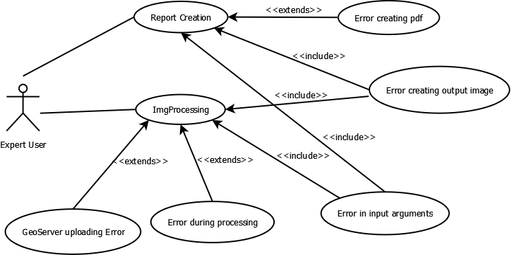

# Genarate a full report on WASDI

## Design Requirement Specification Document

DIBRIS – Università di Genova. Scuola Politecnica, Corso di Ingegneria del Software 80154

 <b> Authors </b>   Abdullah Al Foysal  Alessandro Drago 

### REVISION HISTORY

Version | Data | Author(s)| Notes
---------|------|--------|------
1 | 05/21/23 | Alessandro Drago | First Versionn of the document. Document Template.
2 | 05/22/23 | Alessandro Drago | Added System Architecture and refined some parts.
3 | 06/08/23 | Alessandro Drago | Refined some parts.
4 | 07/08/23 | Abdullah Al Foysal, Alessandro Drago | Added some parts.

## Table of Content

1. [Introduction](#intro)
    1. [Purpose and Scope](#purpose)  
    2. [Definitions](#def)
    3. [Document Overview](#overview)
    4. [Bibliography](#biblio)
2. [Project Description](#description)
    1. [Project Introduction](#project-intro)
    2. [Technologies used](#tech)
    3. [Assumptions and Constraints](#constraints)
3. [System Overview](#system-overview)
    1. [System Architecture](#architecture)
    2. [System Interfaces](#interfaces)
    3. [System Data](#data)
        1. [System Inputs](#inputs)
        2. [System Outputs](#outputs)
4. [System Module 1](#sys-module-1)
    1. [Structural Diagrams](#sd)
        1. [Class Diagram](#cd)
            1. [Class Description](#cd-description)
        2. [Object Diagram](#od)
        3. [Dynamic Models](#dm)
5. [System Module 2](#sys-module-2)
   1. ...

##    1 Introduction

    
 The design specification document reflects the design and provides directions to the builders and coders of the product.
 
    Through this document, designers communicate the design for the product to which the builders or coders must comply. The design specification should state how the design will meet the requirements.

    
###  1.1 Purpose and Scope

 
    
 The goal of this is to create a full report of the analysis done by the reaserchers on WASDI.
    

    
The project involves the developement of a platform that helps Earth Observation (EO) experts process satellite imagery on the cloud. The team at WASDI is working on developing new software tools that can extract images and data from the results of the analytics tools present on the platform, in order to help communicate the results of the analyses to the stakeholders involved. The project aims to ease the communication of the results of the applications so that decision makers can better understand the phenomena they are dealing with.

###  1.2 Definitions
    
| Acronym				| Definition | 
| ------------------------------------- | ----------- | 
| SE23                                 | Software Engineering course, 2023 at university of Genoa |
| SE-80154							   | Software Engineering course, 2023 at university of Genoa, 80154 is its ID number |
| WASDI								   | Web Advanced Space Developer Interface |
| FadeOut Software					   | Company holder of WASDI |
| EO					   			   | Earth Observation |
| TIFF					   			   | Stands for Tag Image File Format. It is a file format used to store raster graphics and image information. |
| GeoServer					   		   | Open source server for sharing geospatial data |
| Workspace							   | Space on WASDI where a user can store and manipulate satellitar images |

###  1.4 Bibliography

 
    
 Useful documentation 
    

    
https://wasdi.readthedocs.io/en/latest/index.html (WASDI documentation)

    
https://docs.geoserver.org/ (GeoServer documentation)

##  2 Project Description

###  2.1 Project Introduction 

 
    
Through workspaces and applications in the marketplace, researchers are able to collect satellite data and run algorithms on them. Once this phase is finished, a required feature is the ability to create a report in PDF containing all the information from the processing.This report will then be given by the researchers to those less experienced users or stakeholders. 
    The document shall have a predefined template in which various information such as date, name and logo of the company, images that were processed and explanatory paragraphs of text are present.
    The images found in WASDI's workspace are in TIFF format and therefore before they are inserted into the document, they must be processed. 
    On the various servers in which these images are stored is an instance of GeoServer is present. 
    So the idea is to take the images from the WASDI workspace, process them with GeoServer by, for example, selecting a certain area of that image, or applying a style, and return this image in a desirable format (PNG or GIF).

###  2.2 Technologies used

 
    
 Software used to develope the algorithm. 

    
https://www.jetbrains.com/pycharm/  (PyCharm IDE)

    
https://www.wasdi.net/#!/home (WASDI cloud services and libraries)

    
https://geoserver.org/ (GeoServer Open source server for sharing geospatial data)

###  2.3 Assumption and Constraint 

 
    
 Assumptions and Constraints

    
Since this is a WASDI processor you will need an account to execute the code correctly.

##   3 System Overview

 
    
 System Overview
    

    
Graphical representation of the system overview.

    

| Use Case      | 1.0           |
| ------------- | ------------- |
| Name          | ImgProcessing |
| Actors        | Expert User  |    
| Entry Point   | (i) List of Input Arguments   (ii) List of Output Arguments   |
| Exit  Point   | File where the processed image must be stored in the correct format |
| Event Flow    | (1) User invoke the system by command line (for now)   (2) User provide a valid path to an input image in .TIFF format present in a WASDI workspace   (3) User provide a list of symbols representing the input arguments   (4) User provide a list of arguments representing the output arguments   (5) User provide a valid file name where the system should store the output image   (6) System validates the input image   (7) System validates the list of input arguments   (8) System valdiates the list of output arguments   (9) System validates the output file   (10) Input image is uploaded on an instance of GeoServer   (11) The new layer is processed following the input arguments   (12) System correctly process the input file and store the image in memory   (13) System write the image in memory into the output file |
    
    
| Use Case      | 2.0           |
| ------------- | ------------- |
| Name          | Report Creation |
| Actors        | Expert User |    
| Entry Point   | List of Input Arguments |
| Exit  Point   | PDF file where the analysis report must be stored |
| Event Flow    | (1) User invoke the system by command line (for now)   (2) User provide a list of sysmbols representing the input arguments   (3) User provide a valid file name where the system should store the PDF document   (4) System validates the input arguments   (5) System validates the output file   (6) System write the text into the output file | 

###   3.1 System Architecture

 
    
 Graphic of the System Architecture
    

    
Graphical representation of the system architecture.

    

###   3.2 System Interfaces

 
    
 The system should use a command line interface.
    

    
For now we'll develop a command line interface using Python, but a graphical interface will be added in the future.

###   3.3 System Data

 In this section we describe the inputs and their format.

####   3.3.1 System Inputs

 
    
 Here we describe the line inputs of the system.
    

    
The system takes in input two JSON files: the parameters file and a config file required to work with WASDI. In the config file there is the username and password to access WASDI, the workspace name, and the path to the parameters file.
 
    
 In the parameters JSON file the inputs of the system are: 

    <ul> 
        <li> PRODUCT: name of an image in .TIFF format present in the WASDI workspace that we want to process.</li>
        <li> BAND: Range of frequencies along the electromagnetic spectrum that the satellite measures.</li>
        <li> BBOX: A json structure divided into "northEast" and "southWest", in each subfield is specified both a latitude and a longitude. This defines the desired area.</li>
        <li> CRS: Stands for Coordinate Reference System. Defines how georeferenced spatial data relates to real locations on the Earth’s surface.</li>
        <li> WIDTH: desidered width of the image.</li>
        <li> HEIGHT: desidered height of the image.</li>
        <li> FORMAT: desidered format of the image. See at (https://docs.geoserver.org/stable/en/user/services/wms/outputformats.html).</li>
        <li> STYLE: XML file used for styling TIFF images.</li>
        <li> LAYER ID: id of a layer already present on a GeoServer instance.</li>
        <li> GEOSERVER URL: link to an existing server.</li>
    </ul>

####   3.3.2 System Ouputs

 
    
 Here we describe the line outputs of the system.
    

    
The final output of the system is a report in PDF containing all the information from the processing done in WASDI. This report will then be given by the researchers to those less experienced users or stakeholders.

##   4 System Module 1

 
    
 Put a summary of the section
    

    
This sub section should describe ...

###   4.1 Structural Diagrams

 
    
 Put a summary of the section
    

    
This sub section should describe ...

####   4.1.1 Class diagram

 
    
 Put a summary of the section
    

    

#####   4.1.1.1 Class Description

 
    
 Put a summary of the section
    

    
The class CustomPDF represents a customized version of the FPDF class for PDF generation.
*Attributes:
*asParametersDict: a private attribute to hold the parameters dictionary.
*Methods:
*header(): generates the header section of the PDF.
*footer(): generates the footer section of the PDF.
*chapter_title(ch_num, ch_title): generates the chapter title section of the PDF.
*chapter_body(chapter_data): generates the chapter body section of the PDF.
*print_chapter(ch_num, ch_title, chapter_data): prints a chapter, combining the title and body sections.
*This class diagram represents the structure and relationships of the CustomPDF class and its methods based on the provided code.

####   4.1.2 Object diagram

 
    
 Put a summary of the section
    

    
This sub section should describe ...

####   4.2 Dynamic Models

 
    
 Put a summary of the section
    

    
This sub section should describe ...

