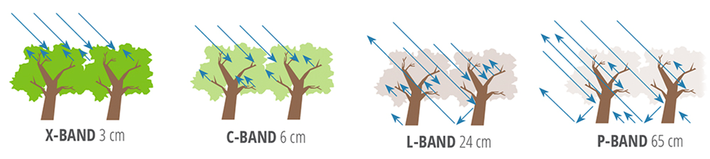

### Elicitation Phase : Gather information about domain and requirement
##### DIBRIS – Università di Genova. Scuola Politecnica, Software Engineering Course 80154

## Table of Contents

1. [Introduction to Earth observation](#p1)
	1. [Definitions](#sp1.1)
2. [Instruments](#p2)
	1. [Passive Instruments](#sp2.1)
	2. [Active Instruments](#sp2.2)
3. [References](#p3)
  

## 1. Introduction to Earth observation
#### What is Earth observation?
> Earth observation is the process of **acquiring observation of the Earth's surface** via different instruments mounted in different platforms. 
> It can be performed via remote-sensing technologies (Earth observation satellites) or through direct-contact sensors in ground-based or airborne platforms (such as weather stations and weather balloons, for example)

This instruments can be:
- Active
- Passive

The platforms could be for example:
- Satellites
- Aircraft
- Drones

### 1.1 Definitions
#### Remote Sensing
> The acquisition of information about an object or phenomenon without making physical contact with the object: the term can be applied to acquiring information about the Earth and other planets.  
> [Remote sensing](https://en.wikipedia.org/wiki/Remote_sensing) can be divided into two types of methods: Passive remote sensing and Active remote sensing. Passive sensors gather radiation that is emitted or reflected by the object or surrounding areas. Reflected sunlight is the most common source of radiation measured by passive sensors. Active collection, on the other hand, emits energy in order to scan objects and areas whereupon a sensor then detects and measures the radiation that is reflected or backscattered from the target.

<picture>
  
</picture>
<picture>
  
</picture>

#### [Spatial resolution](https://en.wikipedia.org/wiki/Spatial_resolution)
How can I measure an image resolution? 
> One possibility is the physical dimension that represent a pixel of the image.

#### Spectral resolution
> Spectral resolution describes the amount of spectral detail in a band.   
Spectral resolution is the ability of a sensor to discern finer wavelengths, that is, having more and narrower bands. Many sensors are considered to be multispectral, meaning they have 3-10 bands. Some sensors have hundreds to even thousands of bands and are considered to be hyperspectral.
The narrower the range of wavelengths for a given band, the finer the spectral resolution.

#### Revisit time
> The time elapsed between subsequent observations of the same area of interest.

## 2. Instruments 
Not all the electromagnetic spectrum can be used for Earth observation. We could use:
- The visible spectrum (~0,39 – ~0,70 mm)
- Part of the infrared spectrum (~0,70 – ~14 mm)
- The radio wave range (~1 cm – ~11m)

<picture>
  
</picture>

### 2.1 Passive Instruments 
This type of instruments **detect elettromagnetic emissions** from the components of the Earth's surface and atmosphere.
This method depends on the day/night cycle and can be degraded or blocked by cloud cover.

There are different types of passive imagery.

#### 2.1.1 **Panchromatic imagery**
> Measure of light intensity over a broad range of the electromagnetic spectrum -> higher spatial resolution

#### 2.1.2 **Multi-spectral imagery**
> Measure of light intensity in several narrow bands of the electromagnetic spectrum -> lower spatial resolution

#### 2.1.3 **Pan-sharpened imagery**
> The process of merging multi-spectral images with panchromatic images to provide high resolution coloured images

#### 2.1.4 **Hyper-spectral imagery**
> Measure of light intensity in a nearly-continuous spectrum. Allows for detection, identification and quantification of surface materials, as well as inferring biological and chemical processes. 

### 2.2 Active Instruments 
Instruments are composed of a transmitter that **sends out a specific electromagnetic signal** and of a receiver to **capture the interaction of the signal with the Earth’s surface**.
 -> don't depend on solar illumination

There are different types of active imagery.

#### 2.2.1 **Synthetic Aperture Radar (SAR)**
Transmits electromagnetic pulses towards the Earth’s surface where they are reflected by the surface features. The instrument’s antenna can detect and record the return pulses. **The intensity of the return pulse and the time** it takes to arrive back at the antenna are used to generate SAR imagery.

It is insensitive to the day/night cycle and most of the time to the meteorological conditions, including clouds.

The wavelength determines how the radar signal interacts with the surface and how far a signal can penetrate into a medium.

<picture>
  
</picture>

Some of the application of SAR are:
- Flood mapping 
- Deformation mapping: earthquakes, landslides
- DEM creation

#### 2.2.2 **Light Detection And Ranging (LiDAR)**
So as SAR trasmits electromagnetic pulses towards the Earth’s surface and then the return pulses are recorded, but uses only the **IR, visible or UV wavelengths**.

Lidars are used for **precise measurement of topographic features**, monitoring growth or decline of glaciers, profiling clouds, measuring winds, studying aerosols and quantifying various atmospheric components.

#### 2.2.3 **Radar altimeter**
Thanks to the ranging capability of radar it measure the surface topography profile along the satellite track. They provide precise measurements of a satellite's height above the ocean by measuring the time interval between the transmission and reception of very short electromagnetic pulses.

#### 2.2.4 **Radar scatterometer**
A radar scatterometer is a microwave radar sensor used to measure the **reflection** or scattering effect **produced while scanning the surface of the Earth** from an aircraft or a satellite. It provides a measure of wind speed and direction near the sea surface.

## 3.0 References
- https://en.wikipedia.org/wiki/Earth_observation
- https://www.esa.int/Applications/Observing_the_Earth
- https://www.oecd.org/environment/indicators-modelling-outlooks/Earth_Observation_for_Decision_Making.pdf
- https://www.earthdata.nasa.gov/learn/backgrounders/remote-sensing#:~:text=Spectral%20resolution%20is%20the%20ability,are%20considered%20to%20be%20hyperspectral.
- https://gisgeography.com/spatial-resolution-vs-spectral-resolution/
